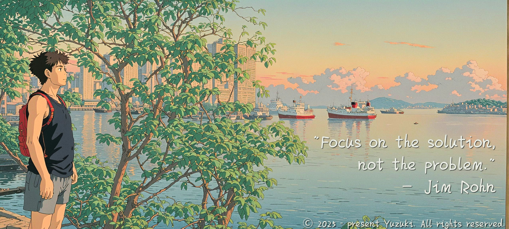

<!-- PROJECT SHIELDS -->
<!--
*** Markdown "reference style" are in-used to all links for readability.
*** Reference links are enclosed in brackets [ ] instead of parentheses ( ).
*** See the bottom of this document for the declaration of the reference variables
*** for contributors-url, forks-url, etc. This is an optional, concise syntax you may use.
*** https://www.markdownguide.org/basic-syntax/#reference-style-links
-->

 

  
GitHub Stats:

  <a href="https://github.com/ChocolaMilk92">
    <table>
      <tr>
        <td>
          
        </td>
        <td>
          
        </td>
      </tr>
    </table>
  </a>

### Welcome to My GitHub Profile
Hi! I'm Gordon. You may know me from Discord (My Discord account/ Discord bot I made), my YouTube channel, my Instagram, my personal portfolio site... or if you haven't, nice to meet you 😊!

I'm a 19 y/o college undergrad student at **[City University of Hong Kong](https://www.cityu.edu.hk/)**, majoring in Electrical engineering? (not really sure for now...) I have been programming since around 2022 (theoretically...), mostly self-taught and learned from high school subjects.

 

## 🚀 About Me

- 🌟 **Who I Am:** A passionate developer and open-source enthusiast. (*Copyright infringement* is not acceptable imo)
- 💻 **What I Do:** Writing code, building projects, and learning something new every day.
- 🎯 **Current Focus:** Building full-stack web applications.
- 🌱 **Currently Learning:** Curl, React, TypeScript, cloud computing...

 

My first language was **[Python][Python]**, which is still my main language, but I've used and still use a lot of other languages such as: **JavaScript (JS)**/**[TypeScript (TS)][TypeScript]** (with **HTML** & **CSS**), **[Docker][Docker]**, **SQL** (When I was in high school. Using **[MongoDB][MongoDB]** for now), **C** (For my flipper-zero), and **[R](https://www.r-project.org/)**.

My language of preference depends on the project and how I feel, but generally:
- I use **[Python][Python]** and **[Docker][Docker]** on large projects such as websites
- I use **[Python][Python]** (mainly) or **JS**/**[TS][TypeScript]** on small projects
- I use **[Python][Python]** or **C** for programs that require high-performance
- **JS**/**[TS][TypeScript]**, **HTML**5, **CSS**, and **[MongoDB][MongoDB]** are mostly used in web projects

My favorites are definitely **[Python][Python]** and **[R][R]**; **[Python][Python]** for flexibility and beginner-friendly, and **[R][R]** for awesome graph plotting and analysis.

 

## 🛠️ Projects & Repositories

I usually work on whatever sparks my interest and enjoy learning new things with each project I take on.

### 🔥 Featured Projects
- [IPv4 info retriever](https://github.com/ChocolaMilk92/ipv4-info-retriever): A super lightweight Python script that retrieves detailed info for an IPv4 address.
- [Skylar <3 (Unpublished)](https://github.com/ChocolaMilk92/Skylar3-Internal): A Discord Bot that utilize with discordpy.

### 🧠 Honorable Mentions
- [Telegram Bot](https://github.com/ChocolaMilk92/telegram-bot): My first Python project. This was where the adventure started.
- [Magic Switch Box](https://github.com/ChocolaMilk92/magic-switch-box-microbit): A project work on with my groupmate in college.

 

## 🔧 Technologies & Tools

Here are some of the tools and technologies I now use:

and later:

 

## 🤝 Connect with Me

[][Contact_X] &nbsp;&nbsp; [][Contact_TG] &nbsp;&nbsp; [][My_Website] &nbsp; &nbsp; [][Contact_Email]

 

## 🌟 Fun Facts About Me

- 🎮 I enjoy gaming when I’m not coding.
- 🟠 Orange is my most fav fruit & color 🍊
- 📚 Reading books about tech, science, or personal development is my jam.
- 🛤️ Always up for a challenge and love solving problems.

 

## ❤️ Support

If you like what I do, consider giving my repositories a ⭐ or [buying me a coffee](https://buymeacoffee.com/goldenlight6628)! 😊🥺
\
\
\
\
\
*"Sometimes it's the journey that teaches you about the destination" - Drake*

2024 MMXXIV © ChocolaMilk92, All rights reserved.

<!--Links in use in this markdown for refrences-->

[Contact_Email]: mailto:cont.chocolamilk92.dev@outlook.com

[Contact_X]: https://x.com/goldenlight6628

[My_Website]: https://beacons.ai/goldenching5838

[Contact_TG]: https://t.me/CodeCrafter404

[City_UHK]: https://www.cityu.edu.hk/

[discord.py_GitHub]: https://github.com/Rapptz/discord.py

[Python]: https://www.python.org/downloads/

[Docker]: https://www.docker.com/

[R]: https://www.r-project.org/

[TypeScript]: https://www.typescriptlang.org/

[MongoDB]: https://www.mongodb.com/
